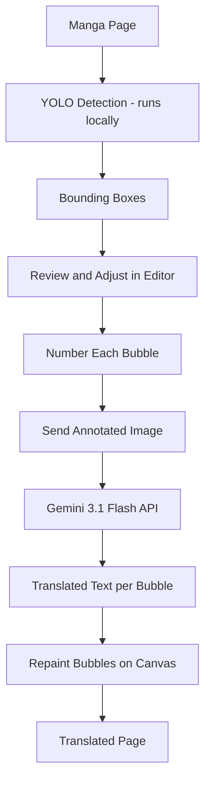

# ComicTL

A browser extension that translates manga pages in-place. Click a page, adjust the detected speech bubbles if needed, confirm, and the translated text gets painted directly onto the image.

This is v0.1.0, cloud mode only. Local mode (no API key, fully on-device) is planned for v1.0.

---

## How it works



Detection runs entirely on your machine using a YOLO ONNX model. No image is sent anywhere during detection. After you confirm the boxes, the annotated image is sent to the Gemini API for translation. The translated text is then painted back onto the original page using a canvas overlay.

No account needed. No login. Just a Gemini API key.

---

## Requirements

- Chrome or Firefox
- A Gemini API key, available for free at [aistudio.google.com](https://aistudio.google.com)

---

## Installation

Go to the [v0.1.0 release page](https://github.com/kiuyha/ComicTL/releases/tag/v0.1.0) and download the zip for your browser. No account or login is required to use the extension.

### Chrome

1. Download `comic-tl-0.0.1-chrome.zip` and unzip it anywhere on your machine
2. Open Chrome and go to `chrome://extensions`
3. Enable **Developer mode** using the toggle in the top right
4. Click **Load unpacked** and select the unzipped folder
5. The ComicTL icon will appear in your extensions bar

### Firefox

1. Download `comic-tl-0.0.1-firefox.zip` and unzip it anywhere on your machine
2. Open Firefox and go to `about:debugging#/runtime/this-firefox`
3. Click **Load Temporary Add-on**
4. Select any file inside the unzipped folder
5. The ComicTL icon will appear in your toolbar

> Note: Firefox does not persist temporary add-ons across restarts. A signed Firefox release is planned for a future version.

### First-time setup

Open the extension popup after installing and go to **Settings**. Paste your Gemini API key into the API Key field. Switch the mode from Local to Cloud in the Home tab. You are ready to translate.

---

## Usage

1. Open any manga page in your browser
2. Click the ComicTL icon and click **Translate Now**
3. The overlay appears and runs bubble detection automatically
4. Review the numbered bounding boxes. You can drag to move them, resize by the corner handles, add new ones, or delete unwanted ones
5. Click **Confirm** to send to Gemini and paint the translation onto the page
6. Click **Original** to toggle between the translated and original image at any time

---

## Features

**Bubble editor**
Detected boxes are numbered in manga reading order (right to left, top to bottom). You can drag, resize, add, or delete boxes before translating. Undo and redo are supported.

**Series context**
Set a title, summary, and custom dictionary per series in the Context tab. These are sent to Gemini alongside the image so character names and terminology stay consistent across chapters.

**Custom fonts**
Choose from bundled fonts (Noto Sans, Bangers, Comic Neue) or drag and drop your own TTF, OTF, or WOFF file directly into the Settings tab. The selected font is used when painting translated text.

**Translation history**
The last five translations for a series are stored locally and used as context for subsequent pages, which helps Gemini keep names and tone consistent.

**Anonymous data sharing**
Opt in during onboarding to share bounding box coordinates when you manually adjust boxes. This data is used to improve the detection model. No images or translated text are ever sent.

---

## Detection model

The bubble detector is a custom YOLO26 model trained on 5,595 manga pages from Manga109-s and MangaDex (English and Vietnamese). It runs locally in an offscreen document via ONNX Runtime Web, so nothing is sent to any server during detection.

Two model sizes are available and can be switched in Settings:

| Model | Precision | Recall | mAP@50 | mAP@50-95 | Params |
|---|---|---|---|---|---|
| YOLO26-Nano (default) | 0.929 | 0.863 | 0.947 | 0.765 | 2.4M |
| YOLO26-Small | 0.937 | 0.893 | 0.961 | 0.802 | 9.5M |

The Nano model is the default. It is fast enough for real-time use and accurate enough for most manga. The Small model is more accurate on dense or small text but takes roughly 2.5x longer to run.

Model weights are hosted on Hugging Face: [Kiuyha/Manga-Bubble-YOLO](https://huggingface.co/Kiuyha/Manga-Bubble-YOLO)

### Detection settings

All detection settings are configurable in the **Settings** tab of the popup.

| Setting | Description |
|---|---|
| Model | Switch between YOLO26-Nano and YOLO26-Small |
| Min Confidence | Boxes below this threshold are discarded (default 0.5, range 0 to 1) |
| Auto-Update | Automatically download new model weights when a newer version is available |

Lowering the confidence threshold catches more bubbles but increases false positives. Raising it reduces noise but may miss smaller or lower-contrast text regions.

---

## Tech stack

| Layer | Technology |
|---|---|
| Extension framework | [WXT](https://wxt.dev) |
| UI | [Svelte 5](https://svelte.dev) with runes |
| Language | TypeScript |
| Styling | Tailwind CSS |
| Detection | [YOLO26 ONNX](https://huggingface.co/Kiuyha/Manga-Bubble-YOLO), runs in an offscreen document |
| Translation | Gemini 3.1 Flash via REST API |
| Storage | WXT storage (wraps chrome.storage) |
| Build | Bun |
| Data pipeline | Supabase (bbox submissions) + Google Drive (archive) |

WXT handles the cross-browser build output, manifest generation, and content script injection. Svelte 5 runes are used throughout for fine-grained reactivity without a virtual DOM. The YOLO model runs inside a dedicated offscreen document so it does not block the page.

---

## Building from source

Requires [Bun](https://bun.sh).

```bash
# Install dependencies
bun install

# Development with hot reload
bun run dev           # Chrome
bun run dev:firefox   # Firefox

# Production build
bun run build         # Chrome
bun run build:firefox # Firefox
```

Copy `.env.example` to `.env` and fill in the values before building.

---

## Project structure

```
src/
  assets/
    app.css          # Global styles and bundled @font-face declarations
    fonts/           # Bundled font files (Noto Sans, Bangers, Comic Neue)

  entrypoints/
    background.ts    # Service worker, handles detection and Gemini requests
    content.ts       # Injected into manga pages, mounts the overlay UI
    offscreen/       # Offscreen document used to run YOLO inference
    popup/           # Extension popup: Home, Context, and Settings tabs

  lib/
    adapters.ts      # Site adapters for reading series name, chapter, page index
    components/      # Svelte components including the bbox overlay and toolbar
    detections.ts    # YOLO ONNX inference wrapper
    gemini.ts        # Gemini API client and prompt construction
    utils.ts         # Canvas painting, text fitting, image inpainting, bbox utilities
```

---

## Roadmap

- **v1.0** -- Local mode: on-device OCR and translation with no API key required
- **v2.0** -- Auto scan: translate pages in the background without manual box review

---

## License

[MIT](https://github.com/kiuyha/ComicTL/blob/main/LICENSE)