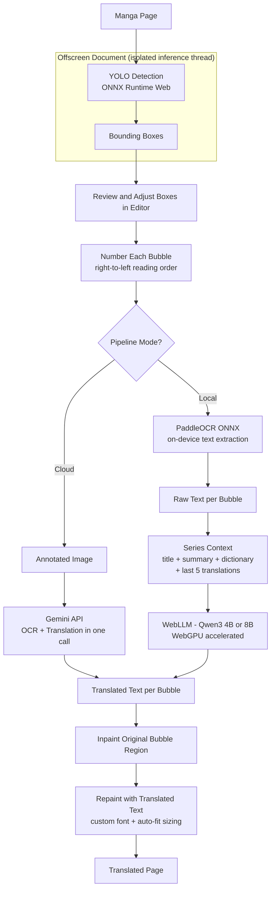

# ComicTL

Translate manga in your browser. Detection runs on your machine, OCR runs on your machine, translation runs on your machine. Nothing leaves your browser unless you want it to.

**Website:** [comictl.kiuyha.my.id](https://comictl.kiuyha.my.id) | **Releases:** [Latest](https://github.com/kiuyha/ComicTL/releases/latest)


---

## Two Modes, One Pipeline

**Local Mode** runs everything on-device. YOLO26 finds the bubbles, PaddleOCR reads the text, and Qwen3 via WebLLM translates it on WebGPU. No API key, no account, no uploads.

**Cloud Mode** sends the annotated image to Gemini, which handles both OCR and translation in one shot. Your key goes straight from your browser to Google. It never touches a proxy or middleman server.

Either way, the translated text gets painted directly onto the page. Toggle back to the original any time.

---

## How It Works


```mermaid
graph TD
    Img[Manga Page] --> Detect

    subgraph offscreen ["Offscreen Document (isolated inference thread)"]
        Detect["YOLO Detection
ONNX Runtime Web"]
        Detect --> Boxes[Bounding Boxes]
    end

    Boxes --> Refine[Review and Adjust Boxes in Editor]
    Refine --> Annotate["Number Each Bubble
right-to-left reading order"]
    Annotate --> Mode{Pipeline Mode?}

    Mode -->|Cloud| CloudImg[Annotated Image]
    CloudImg --> Gemini["Gemini API
OCR + Translation in one call"]
    Gemini --> Text

    Mode -->|Local| OCR["PaddleOCR ONNX
on-device text extraction"]
    OCR --> Raw[Raw Text per Bubble]
    Raw --> Ctx["Series Context
title + summary + dictionary
+ last 5 translations"]
    Ctx --> LLM["WebLLM - Qwen3 4B or 8B
WebGPU accelerated"]
    LLM --> Text[Translated Text per Bubble]

    Text --> Inpaint[Inpaint Original Bubble Region]
    Inpaint --> Paint["Repaint with Translated Text
custom font + auto-fit sizing"]
    Paint --> Result[Translated Page]
```

Detection never sends an image anywhere. The YOLO model runs in a dedicated offscreen document, keeping inference off the main page thread and away from the popup UI.

---

## Features

**Full local pipeline.** YOLO26-Nano runs via ONNX Runtime Web. PaddleOCR extracts text on-device. Qwen3 4B or 8B translates via WebLLM with WebGPU acceleration. After the first model download, the whole pipeline works offline.

**Cloud option.** Point ComicTL at any Gemini model you have access to. The annotated image goes directly from your browser to the Gemini API. Good for when you want higher accuracy or your machine does not have a GPU.

**Bubble editor.** Detected boxes are numbered in manga reading order (right to left, top to bottom). Drag, resize, add, delete, undo, redo before you commit to translating.

**Series context.** Set a title, plot summary, and custom glossary per series. The last five translations get included automatically so character names and terminology stay consistent across chapters.

**Site adapters.** ComicTL matches the current URL against a list of community-written regex rules to extract the series name, chapter ID, and page index. If your site is not covered, the extension can generate a rule for it using whichever AI you have active. You can also write one manually in about three minutes and submit a PR. More on this below.

**Custom fonts.** Three fonts ship with the extension (Noto Sans, Bangers, Comic Neue). Drop any TTF, OTF, or WOFF file into the Settings tab to use your own.

**Opt-in improvement data.** When you correct a bounding box, ComicTL can send the adjusted coordinates to help retrain the detection model. No images, no text, just coordinates. This is opt-in during onboarding and can be turned off at any time.

---

## Installation

Download the zip for your browser from the [releases page](https://github.com/kiuyha/ComicTL/releases/latest).

### Chrome

1. Download `comic-tl-<version>-chrome.zip` and unzip it anywhere
2. Open `chrome://extensions`
3. Enable **Developer mode** (toggle in the top right)
4. Click **Load unpacked** and select the unzipped folder

### Firefox

1. Download `comic-tl-<version>-firefox.zip` and unzip it
2. Open `about:debugging#/runtime/this-firefox`
3. Click **Load Temporary Add-on**
4. Select any file inside the unzipped folder

> Firefox temporary add-ons do not survive a browser restart. A signed Firefox release is planned for a future version.

### First-time setup

Open the extension popup and go to **Settings**.

- **Cloud Mode:** paste your Gemini API key (free at [aistudio.google.com](https://aistudio.google.com)), then set the mode to Cloud in the Home tab.
- **Local Mode:** select Local in the Home tab and let the model weights download once. Roughly 3-6 GB depending on which LLM you pick.

---

## Quick Start

1. Open any manga page in Chrome or Firefox
2. Click the ComicTL icon, or right-click the page and select **Translate Image**
3. The overlay opens and runs bubble detection automatically
4. Adjust any boxes that were missed or drawn wrong
5. Click **Confirm**
6. Read

---

## Adding Site Support (Pull Requests Welcome)

ComicTL figures out the series name, chapter ID, and page index for each URL using a small array of regex rules in [`src/lib/adapters.ts`](src/lib/adapters.ts). Most manga sites are not in that list yet.

Adding one is the shortest contribution you can make to this project, and it helps everyone who reads on that site.

### What a rule looks like

```typescript
// src/lib/adapters.ts

// COMMUNITY RULES -- PULL REQUESTS WELCOME!
// To add a new site, add a new object to this array.
export const COMMUNITY_RULES: SiteRule[] = [
  {
    id: "mangadex",
    domain: "mangadex.org",
    seriesName: {
      regex: "^(?:.*?\\|\\s*)?(?:(?:Chapter|Vol)[^\\-]+\\-\\s*)?(.*?)\\s*\\-\\s*MangaDex",
      source: "title",     // extract from document.title
    },
    chapterId: {
      regex: "\\/chapter\\/([^/]+)",
      source: "path",      // extract from window.location.pathname
    },
    pageIndex: {
      regex: "\\/(\\d+)\\/?$",
      source: "path",
    },
  },
  // your rule goes here
];
```

Each rule needs three fields: `seriesName`, `chapterId`, and `pageIndex`. Each field names a source (`"title"` or `"path"`) and a regex with one capturing group that isolates the value you want.

### You do not need to write the regex by hand

Open any chapter on the site you want to support, click the ComicTL icon, and use the **AI rule generator** in Settings. It reads the current page title and URL, sends them to whichever AI you have active (Local or Cloud), and returns a draft rule you can paste straight into the array.

The one rule: the regex has to work for any manga on that site, not just the one you tested on. The generator is prompted to handle this, but check the output before submitting.

### Submitting

1. Fork the repo
2. Add your object to `COMMUNITY_RULES` in `src/lib/adapters.ts`
3. Open a PR with the site name in the title

If you are new to open source, this is a good starting point. The format is small, the file is self-contained, and there is no build step required to test the regex.

---

## Detection Model

The bubble detector is a custom YOLO26 model trained on 5,595 manga pages from Manga109-s and MangaDex. It runs locally in the offscreen document via ONNX Runtime Web.

| Model | Precision | Recall | mAP@50 | mAP@50-95 | Params |
|---|---|---|---|---|---|
| YOLO26-Nano (default) | 0.929 | 0.863 | 0.947 | 0.765 | 2.4M |
| YOLO26-Small | 0.937 | 0.893 | 0.961 | 0.802 | 9.5M |

Nano is fast enough for interactive use and handles most manga without issues. Small is more accurate on pages with dense or small text but takes roughly 2.5x longer to run. Weights are on Hugging Face: [Kiuyha/Manga-Bubble-YOLO](https://huggingface.co/Kiuyha/Manga-Bubble-YOLO).

### Detection settings

| Setting | Default | Notes |
|---|---|---|
| Model | YOLO26-Nano | Switch to Small for dense or small-text pages |
| Min Confidence | 0.5 | Lower catches more bubbles but increases false positives |
| Auto-Update | On | Downloads new weights automatically when available |

---

## Tech Stack

| Layer | Technology |
|---|---|
| Extension framework | [WXT](https://wxt.dev) |
| UI | [Svelte 5](https://svelte.dev) with runes |
| Language | TypeScript |
| Styling | Tailwind CSS |
| Bubble detection | YOLO26 ONNX, runs in offscreen document via ONNX Runtime Web |
| On-device OCR | PaddleOCR ONNX |
| On-device translation | [WebLLM](https://webllm.mlc.ai/) |
| Cloud translation | Gemini API via REST |
| Storage | WXT storage (wraps chrome.storage) |
| Build | Bun |
| Telemetry | Supabase (opt-in bbox coordinates only) |

---

## Building from Source

Requires [Bun](https://bun.sh).

```bash
bun install

# Development with hot reload
bun run dev           # Chrome
bun run dev:firefox   # Firefox

# Production build
bun run build
bun run build:firefox
```

Copy `.env.example` to `.env` and fill in the values before building.

---

## Project Structure

```
src/
  assets/
    app.css              # Global styles and @font-face declarations
    fonts/               # Bundled fonts (Noto Sans, Bangers, Comic Neue)

  entrypoints/
    background/          # Service worker: coordinates detection and API calls
    content/             # Injected into the page, mounts the overlay UI
    offscreen/           # Isolated document for YOLO and OCR inference
    popup/               # Extension popup (Home, Context, Settings tabs)
    setup/               # Onboarding flow shown on first install

  lib/
    adapters.ts          # COMMUNITY_RULES and URL-to-metadata matching
    components/
      Overlay.svelte     # Bubble editor and translation overlay
    configs.ts           # Defaults: models, languages, fonts, thresholds
    detections/          # YOLO ONNX inference wrapper
    gemini/              # Gemini API client and prompt construction
    ocr/                 # PaddleOCR ONNX inference wrapper
    utils.ts             # Canvas painting, text fitting, inpainting, bbox math
    webllm.ts            # WebLLM loader and translation interface
```

---

## Roadmap

- **v2.0**: Auto scan: translate pages in the background without manual box review

---

## Contributing

The easiest place to start is a site adapter PR as described above. For bug reports or feature ideas, open an issue. For larger changes, an issue first saves everyone time.

---

## License

[MIT](LICENSE)
